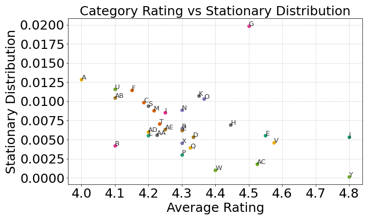

# Restaurant-Analysis

This project uses a graph-theoretic approach to analyze restaurant co-visitation behavior based on Yelp data. It explores the relationship between **rating** (quality) and **popularity** (how often a restaurant is visited).

---

##  Project Pipeline

1. **Data Collection**  
   Fetched restaurant data via the Yelp API.

2. **Data Cleaning**  
   Standardized categories, filtered incomplete entries, and stored data in a SQLite database.

3. **User Simulation**  
   Created synthetic users to simulate co-visitation behavior based on realistic preferences. Here we assumed, that a user
   is prefering restaurant with similar price and categroy, where price is more important than categroy.

4. **Transition Network Construction**  
   Built a directed weighted network where nodes are restaurants, and edge weights depend on both co-visitation frequency and rating-based transition probabilities.

5. **Markov Modeling**  
   Applied PageRank to model long-term visitation behavior and compute the stationary distribution.
   Herefore, chose the right damping factor and test statioanry property.

---

##  Key Insights

- Popularity and quality are **not always aligned**.  
- The **stationary distribution** reveals which restaurants users tend to return to over time.  
- Certain cuisines (e.g., Burgers, Thai, Indian displays by letters in the plot below) show stronger staying power than others.  

---

##  Folder Structure

- users.json # Synthetic/anonymized user reviews
- cleaned_yelp_data.db # Cleaned Yelp restaurant data in SQLite format
- Transition_Network.py # Builds the network & computes PageRank
- Fake_Users.py # Creates synthetic users
- Database.py # Cleans and stores Yelp data
- fetch_data.py # Pulls restaurant data from Yelp API

## 🧪 How to Run

1. Run `fetch_data.py` to pull raw Yelp data.  
2. Execute `Database.py` to clean and store data.  
3. Run `Fake_Users.py` to generate synthetic users (if needed).  
4. Execute `Transition_Network.py` to build the network and compute PageRank.

---

## Results

The project demonstrates how **graph-based modeling** can provide richer insight into user preferences and restaurant success beyond just ratings.

---

## Data Ethics

- No original Yelp user data is published.  
- All users are either **synthetic** or **anonymized**.  
- Restaurant names may be pseudonymized in any released visualizations.

---

## License

MIT License. Feel free to use, modify, and build upon this project — just be mindful of **data privacy** if applying it to real-world datasets.
