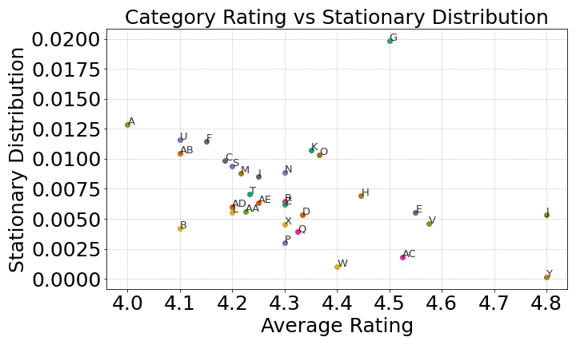
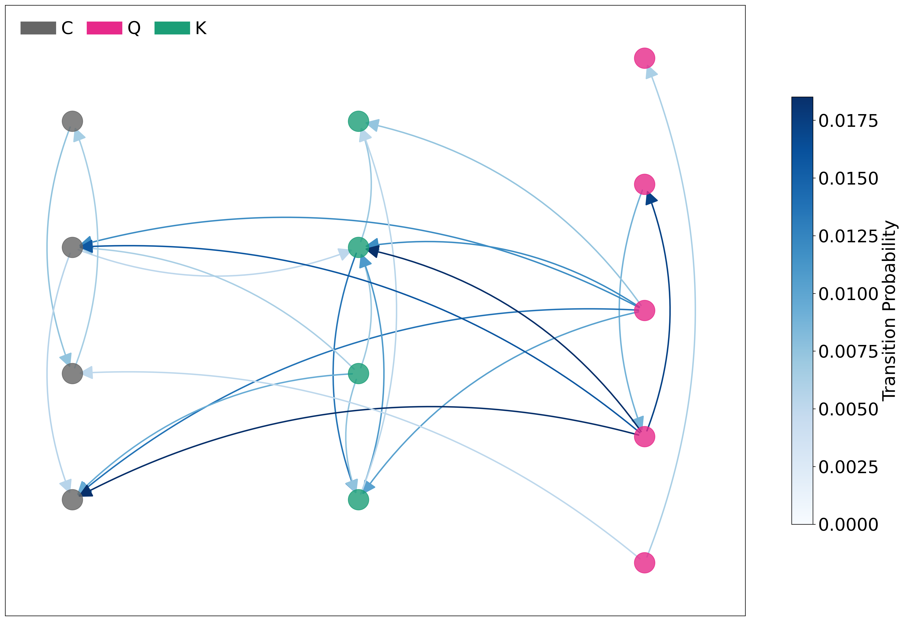

# Restaurant-Analysis

This project uses a graph-theoretic approach to analyze restaurant co-visitation behavior
based on Yelp data. It explores the relationship between **rating** (quality) and **popularity** (how often a restaurant is visited).

---

##  Project Pipeline

1. **Data Collection**  
   Fetched restaurant data via the Yelp API ('fetch_data.py').

2. **Data Cleaning**  
   Standardized categories and stores data in a SQLite database ('ETL.py').

3. **User Simulation**  
   Created synthetic users to simulate co-visitation behavior based on realistic preferences. Here we assumed, that a user
   is prefering restaurants with similar price and category, where price is more important than categroy ('Simulate_Users.py').
   Furthermore, we assume that the number of reviews a visitor is giving is Poisson distributed and a user can rate a restaurant only once.

4. **Transition Network Construction**  
   Built a directed weighted network where nodes are restaurants, and edge weights depend on both co-visitation frequency and rating. Only 
   restarants with at least 'boundary' co-visits are connected and part of the final network.
   The lower the rating, the higher the probability of an user to leave the restaurant: p_u = 1 - (rating_u - 1) / 4.
   The transition probability from restaurant u to v is proportional to the co-visitation frequency between u and v, normalized by the total number of transitions from u.
   This directed network graph illustrates **user transition dynamics** between restaurants. The network is built from:
    
    - **Simulated users** who move between restaurants based on co-visitation frequency and rating-driven likelihoods.
    - **Nodes** represent individual restaurants, colored by their **category** (e.g., Fast Food, Austrian, Vietnamese).
    - **Node labels** show the **restaurant's rating and name** (not in public version).
    - **Edges** represent **directional transitions**. Darker edges indicate **higher transition probabilities**.

    
5. **Popularity Modeling**  
   Applied PageRank to model long-term visitation behavior and compute the stationary distribution.
   Herefore, chose the right damping factor alpha and test statioanry property.

---

##  Key Insights

- Popularity and quality are **not always aligned**.  
- The **stationary distribution** reveals to which restaurants users tend to return to over time.  
- Certain cuisines (e.g., Burgers, Thai, Indian displays anonymous by letters in the plot below) show stronger staying power than others.  

#  Results

## 

This plot visualizes the **average stationary distribution** (a PageRank-like popularity score) against the **average rating** for each restaurant category.  
It highlights interesting contrasts between popularity and perceived quality:

- Some categories achieve high popularity despite varying ratings.
- Others, with strong ratings, may still be niche and not frequently revisited.

This helps distinguish between categories that are broadly appealing and those that are highly rated but less frequently chosen.

---

## 

This visualization reveals how users move across the culinary landscape and helps uncover **category-level dynamics** and **local popularity hubs**.
For example, we observe strong exchange between the restaurants of the brown cluster 'K'. Where the restarants
of the category 'C' and 'Q' are not as well connected. Furthermore the first (from below) restaurant of the 
brown cluster 'K' experience a lot of flow and serves as a hub. 

##  Folder and Data Structure

- fetch_data.py # Pulls restaurant data from Yelp API
- ETL.py # Cleans and stores Yelp data
- cleaned_yelp_data.db # Cleaned Yelp restaurant data in SQLite format
- Simulate_Users.py # Creates synthetic users
- users.json # Synthetic/anonymized user reviews
- Transition_Network.py # Builds the network & computes PageRank

## How to Run

1. Run `fetch_data.py` to pull raw Yelp data.  
2. Execute `ETL.py` to extract, transform and store data.  
3. Run `Simulate_Users.py` to generate synthetic users (if needed).  
4. Execute `Transition_Network.py` to build the network and compute PageRank.

---

## Results

The project demonstrates how **graph-based modeling** can provide richer insight into user preferences and restaurant success beyond just ratings.

---

## Data Ethics

- No original Yelp user data is published.  
- All users are **synthetic**.
- Restaurant names, ratings, categories are pseudonymized in any released visualizations.

---

## License

MIT License. Feel free to use, modify, and build upon this project — just be mindful of **data privacy** if applying it to real-world datasets.
